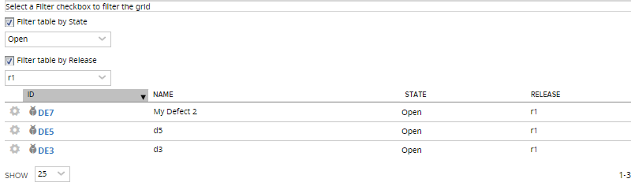

saving selections in comboboxes and checkboxes via localstorage
=========================

## Overview

A few seconds of a [demo video](http://screencast.com/t/F4qoEKm7) on how selections in comboboxes and checkboxes are retained after page is reloaded

This app is available AS IS. It is not supported by Rally support.
## License

AppTemplate is released under the MIT license.  See the file [LICENSE](./LICENSE) for the full text.

##Documentation for SDK

You can find the documentation on our help [site.](https://help.rallydev.com/apps/2.0rc3/doc/)
